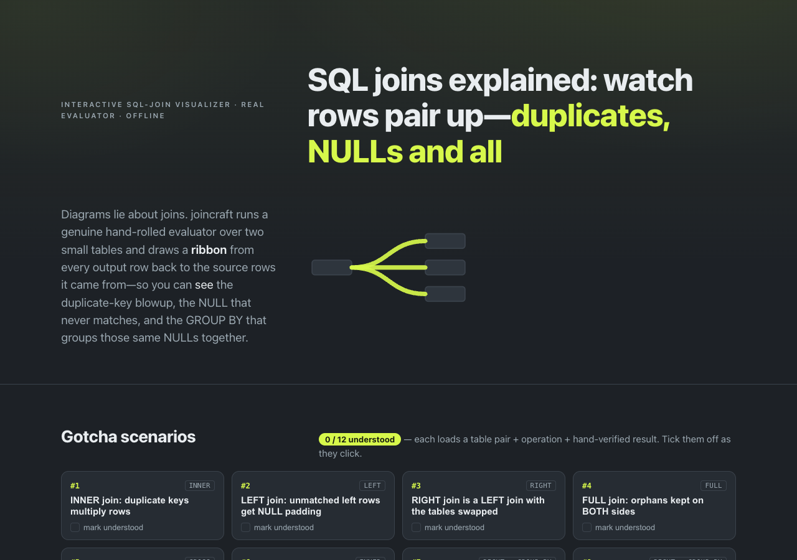

# joincraft

**SQL joins explained: watch rows pair up — duplicates, NULLs and all.** An interactive SQL-join visualizer that runs a genuine hand-rolled evaluator over two small tables and draws a *ribbon* from every output row back to the source rows it came from — so you can *see* the duplicate-key blowup, the NULL that never matches, and the GROUP BY that groups those same NULLs together. 100% client-side, zero dependencies, works fully offline.



## Why

Every "SQL joins explained" article reaches for a Venn diagram. But a Venn diagram is a lie about joins: it cannot draw the case where **one row fans out to many** because a key is duplicated, and it says nothing about **NULL** — the single biggest source of join surprises.

joincraft takes the opposite approach. It is a real evaluator, not a picture. You pick a join (INNER / LEFT / RIGHT / FULL / CROSS) and two small editable tables, and it computes the **exact** result table, draws the pairing as ribbons, and shows the row math — including the moment the output has *more rows than either input*, which no Venn diagram can represent.

It is aimed at analysts, developers, and students Googling "sql joins explained" or "sql join visualizer", and at interview candidates cramming join, NULL, and GROUP BY gotchas the night before.

## Features

- **Five joins on two editable tables** — INNER, LEFT, RIGHT, FULL, CROSS, with inline cell editing, a per-cell NULL toggle, add/delete rows (max 8 per side), and duplicate keys allowed. Edits persist in your browser.
- **Animated join-ribbon view** — every output row draws a ribbon from its left source row to its right source row: **solid** = matched pair, **dashed into a NULL pad** = orphan. Pattern and label encode meaning, never color alone. Step / Play / Show-all playback.
- **Row-math counter strip** — |L|, |R|, matched pairs, left orphans, right orphans, output rows — with a **"a Venn diagram cannot draw this"** callout that fires whenever the output exceeds the larger input (the duplicate-key blowup).
- **The NULL corner** — interactive three-valued-logic truth tables (AND, OR, NOT, `=`, `<>`, `IS NULL`) returning TRUE / FALSE / UNKNOWN, explaining why `NULL = NULL` never matches in an `ON` clause.
- **GROUP BY stage** — pick a group column and an aggregate (COUNT(*), COUNT(col), SUM, AVG, MIN, MAX) over the join result, surfacing that NULLs group *together* under GROUP BY but never match in `ON`, and that COUNT(col)/SUM/AVG skip NULLs.
- **12 one-click gotcha scenarios** — each loads tables + operation + a hand-verified expected result and a short explanation, with a localStorage "understood" checklist (12/12 progress) for multi-visit interview prep.
- **Illustrative ANSI SQL** for the current setup with a copy button, labelled *illustrative syntax — this app is not a SQL engine.*
- **Export as the handoff** — RFC-4180 CSV of the current result set and a printable cheat-sheet (`@media print`).
- **100% offline** — no accounts, no network calls, no tracking.

## How it's verified

joincraft's results are checked **two independent ways**:

1. **Against a real SQL engine at authoring time.** Every table pair and gotcha scenario was written as SQL and run through in-memory **SQLite 3.51**, and its output diffed against the expected rows. See [`sources/verify.sql`](./sources/verify.sql) and [`sources/CITATIONS.md`](./sources/CITATIONS.md). SQLite is the reference because it implements ANSI three-valued logic for NULL and (from 3.39) `RIGHT`/`FULL OUTER JOIN`.
2. **Permanently, in the test suite.** `node --test` asserts the in-app evaluator (`data/engine.js`) `deepStrictEqual`s every expected result, byte-for-byte, in teaching order, plus corpus invariants, the 3VL matrices, and a 3,000-case property test on the join-length arithmetic.

```sh
node --test        # runs the full suite (exits 0)
```

## Quickstart

Just open `index.html` in any modern browser — no build step, no server, no install.

- **Local:** double-click `index.html`, or run a static server in the folder.
- **Hosted:** **[Open joincraft live](https://sreenivas-sadhu-prabhakara.github.io/joincraft/)**

Your table edits and "understood" checklist are saved in your browser's local storage, so they persist between visits.

## Privacy

- A strict Content-Security-Policy sets `connect-src 'none'`: the app **cannot** make any network request even if it tried.
- No external fonts, scripts, images, or analytics. Everything is self-contained.
- All logic runs in your browser. Your tables never leave your device; there is no cloud sync or sharing (CSV/print export is the handoff).
- Because there are no network dependencies, it works with **no signal at all** — download it once and it keeps working offline.

## Honest limits

- **A teaching model, not a SQL engine.** One join (INNER/LEFT/RIGHT/FULL/CROSS) between two small tables, plus one optional GROUP BY aggregate — no WHERE, HAVING, ORDER BY, subqueries, or free-text SQL. The fixed grammar is the honesty contract.
- **Deterministic teaching order.** Rows appear in a fixed order (left row, then right row). Real SQL guarantees no row order without `ORDER BY`.
- **ANSI semantics, cross-checked against SQLite.** Real databases can differ in collation, type coercion, and dialect extensions — verify anything important on your actual database.
- **The SQL text is illustrative** ANSI syntax for reading and copying, not the output of a query engine running here.
- **No large tables** — a hard cap of 8 rows per side keeps the ribbon view and blowup demos legible. This is a teaching model, not a data tool.

## Disclaimer

joincraft is an educational tool that illustrates SQL join and NULL semantics for learning. It is a teaching model, not a database engine, and its output is not a substitute for testing against your real database or for authoritative documentation. This software is provided under the MIT License, "as is", without warranty of any kind; the authors accept no liability for any loss or damage arising from its use.

## License

[MIT](./LICENSE) © 2026 Sreenivas Sadhu Prabhakara
